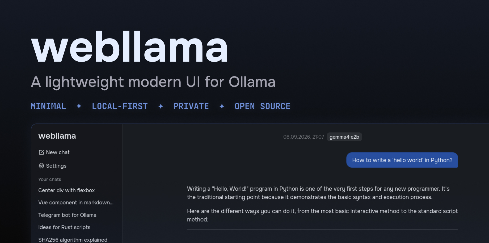
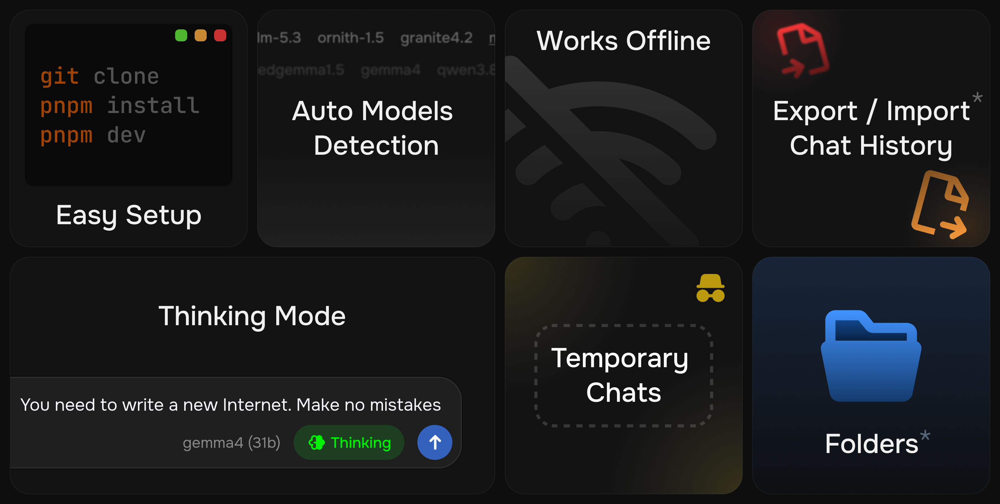

# webllama

**webllama** is a self-hosted web interface for local AI. 

Written in Vue.js. 

Runs in your browser. 

~1.5 MB production build.

Free and open source.



## Table of Contents

- [Overview](#overview)
- [Features](#features)
    - [Getting Started](#-getting-started)
    - [Models and Chat](#-models-and-chat)
    - [Settings](#-settings)
- [⚠️ Before You Start](#-before-you-start)
- [Installation](#installation)
- [Roadmap](#roadmap)
- [Contributing](#contributing)
- [Is it vibecoded?](#is-it-a-vibecoded-app)
- [Feedback](#feedback)
- [License](#license)

## Overview

**webllama** is built with Vite + Vue 3. It runs right in your browser and doesn't require any advanced skills or knowledge to get started. **webllama** can automatically detect and connect to Ollama “right out of the box”.

Your chats are stored directly in your browser using IndexedDB, allowing **webllama** to persist your conversation history locally without relying on a backend. User settings are stored in LocalStorage for quick and persistent access.

## Features



*Features marked with an asterisk (\*) in the image will be implemented soon*

### 🚀 Getting Started

- **Simple setup:** Just clone the repository and run the app right in your browser. Click [here](#installation) to skip to the installation.
- **Automatic models detection:** The app automatically finds and uses models already installed with your local Ollama instance. If you haven't installed Ollama yet, follow [these steps](#before-start).

### 💬 Models and Chat

- **Works offline** - Run and interact with downloaded models through Ollama without an Internet connection.
- **Private** - Your conversations stay on your device. We don't collect information about your device, conversations, or how you use the app. The only external request made by webllama is to this GitHub repository for checking app updates.
- **Chat history storage** - All your conversations are stored directly in your browser (IndexedDB).
- **“Incognito Mode”** - This allows you to have temporary chats without saving them to your history.
- **“Thinking Mode”** - Enable thinking for models that support it. Thinking may improve reasoning on complex tasks but can increase response time.
- **Rich output format** - Supports Markdown, syntax-highlighted code blocks, and LaTeX formulas.

### ⚙️ Settings
- **Ollama instance** - Check Ollama status, control installed and active models, change the default API URL.
- **System prompt** - Use system prompt to define role, behavior, tone, constraints, and output format of your model.

## ⚠️ Before You Start

**webllama** requires [Ollama](https://ollama.com) to be installed and running on your computer.

If you already have Ollama installed, you can skip this section and proceed to [installation](#installation).

If you don't have Ollama yet:

1. Download and install Ollama from the [official website](https://ollama.com/download).
2. Pull a model:

```bash
# For example:
ollama pull gemma4:e2b
```

This downloads Google's `Gemma 4 E2B` model. You can use any model supported by Ollama, including Qwen, Llama, Mistral, DeepSeek, and others.

See the full list of available models on the [Ollama library](https://ollama.com/search).

## Installation 

1. Clone the repository
```bash
git clone https://github.com/kirillmelcin96/webllama.git
```

2. Install dependencies using `pnpm`
```bash
pnpm install
```

3. Run the development server
```bash
pnpm dev
```

4. Open [http://localhost:5173/](http://localhost:5173/) using your browser and start your first chat!

## Roadmap

The project is actively developed. You can track planned features and progress on the [public roadmap](https://github.com/users/kirillmelcin96/projects/3).

Some of the major planned features:
- Ollama and Hugging Face models downloader
- Folders (Projects)
- Image generation support
- Multimodal (vision) models support
- Export/Import chat history
- Search in chats
- Plugins?

## Contributing

### Code

If you'd like to help implement a feature, feel free to do it! You can find currently planned and requested features in the [issues](https://github.com/kirillmelcin96/webllama/issues). I would really appreciate any help.

I strongly encourage contributors to minimize the use of AI-generated code. Commits containing ONLY AI-generated code will not be accepted. If you’ve used AI to write any code snippets or functions, please mark them with a special comment. You can read more about this [here](#is-it-a-vibecoded-app).

### New ideas / Requests

If you have an idea for a feature, please create a new issue by clicking the “New Issue” button > ✨ Feature request.

### Found a bug?

If you want to report a bug, please create a new issue by clicking the “New Issue” button > 🐛 Bug report.

## Is it a vibecoded app?

No, it's not. The vast majority of the code in this repository was written by a human. No AI coding agent was used to build the project.

However, a few small, non-critical functions were AI-assisted at this time. For development transparency, all of these functions are marked with the `AI-ASSISTED` comment in the code in the following format:

```js
// AI-ASSISTED (<Name of LM>): <what it helped with>
```

Contributors are also asked to mark AI-assisted code in this format.

All images are human-made.

## Feedback

Have a question/suggestion? Feel free to contact me:

kerekerekerek@hotmail.com

## License

**webllama** is licensed under the Apache License 2.0

Copyright 2026 Kirill Melcin

### Third-Party Dependencies

**webllama** additionally contains code/libraries with the following licenses: MIT, ISC, 0BSD, CC0-1.0, Apache License 2.0, BSD-2-Clause, BSD 3-Clause.

To see the complete list of dependencies, their licenses, and copyrights, please refer to the `THIRD-PARTY-NOTICES.txt` file.

This file was automatically generated using the [@quantco/pnpm-licenses](https://github.com/Quantco/pnpm-licenses) utility. Generation is triggered by the following command:

```bash
pnpm notices
```
